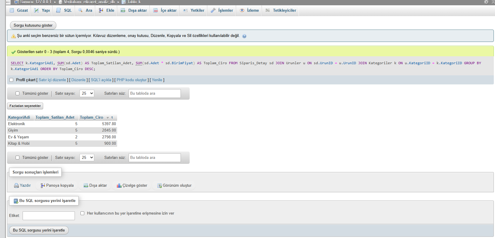

# 🛒 E-Commerce Data Analysis with SQL (MySQL / phpMyAdmin)

Bu proje, bir E-Ticaret platformunun müşteri, sipariş, ürün ve kategori verilerini modellemek ve iş kararlarına yön verecek analitik sorguları çalıştırmak amacıyla hazırlanmış bir **Relational Database & Data Analysis** çalışmasıdır.

---

## 📐 Veritabanı Mimarısı (Tablo Yapısı)

Projede 5 ilişkisel tablo oluşturulmuş ve Primary Key / Foreign Key bağlamları kurgulanmıştır:
- **`Musteriler`**: Müşteri bilgileri ve kayıt tarihleri.
- **`Kategoriler`**: Ürün kategorileri.
- **`Urunler`**: Ürün adı, stok ve fiyat bilgileri.
- **`Siparisler`**: Sipariş tarihleri ve kargo durumları.
- **`Siparis_Detay`**: Sipariş edilen ürünler, adet ve birim fiyat detayları.

---

## 📊 Analiz Sorguları ve Bulgular

### 1. Kategori Bazlı Satış ve Ciro Analizi
Hangi ürün kategorisinin toplamda ne kadar satış adedine ve ciroya ulaştığı analiz edilmiştir.

```sql
SELECT 
    k.KategoriAdi,
    SUM(sd.Adet) AS Toplam_Satilan_Adet,
    SUM(sd.Adet * sd.BirimFiyat) AS Toplam_Ciro
FROM Siparis_Detay sd
JOIN Urunler u ON sd.UrunID = u.UrunID
JOIN Kategoriler k ON u.KategoriID = k.KategoriID
GROUP BY k.KategoriAdi
ORDER BY Toplam_Ciro DESC;



